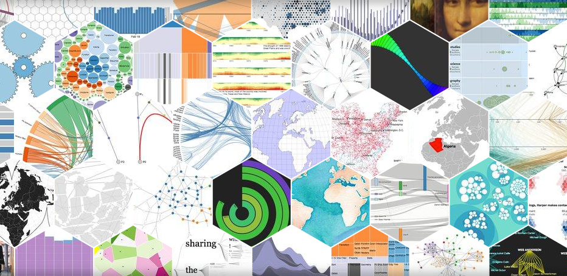

# D3.js, disegna con il codice

Ciao,

benvenuto/a su questa breve guida introduttiva alla scoperta di 

<figure><figcaption>
<a href="https://d3js.org/">d3js.org</a>
</figcaption></figure>

La guida si compone di 2 parti:

* un'introduzione teorica ai concetti base di 
* una parte pratica in cui realizzeremo un semplice grafico mettendo in pratica i principi appresi.

