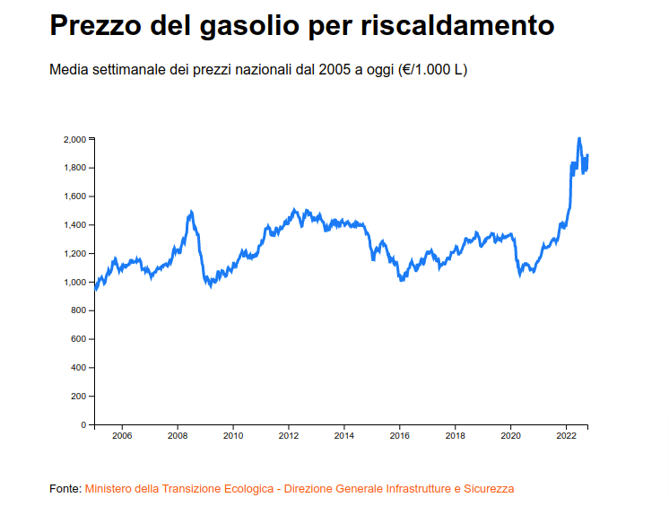

# 📈 Creiamo un grafico

L'andamento avrà sull'asse delle ascisse il tempo e su quello delle ordinate il prezzo.

<figure><figcaption></figcaption></figure>

I dati sono pubblicati dal [Ministero della Trasizione Ecologica](https://dgsaie.mise.gov.it/open-data). Sono in formato csv e fanno parte di un dataset più ampio che contiene i prezzi di più carburanti. Per semplicità è stato ridotto alle sole 2 colonne utili per il caso in oggetto e salvato in locale:&#x20;

* **SURVEY\_DATE** -> data espressa in aaaa-mm-gg
* **HEATING\_GAS\_OIL** -> il prezzo espresso in €/1.000 L

```csv
SURVEY_DATE,HEATING_GAS_OIL
2005-01-03,948.5
2005-01-10,947.94
2005-01-17,952.42
2005-01-24,963.98
2005-01-31,972.95
...
2022-09-12,1825.04
2022-09-19,1771.42
2022-09-26,1789.38
2022-10-03,1792.42
2022-10-10,1894.96
```
