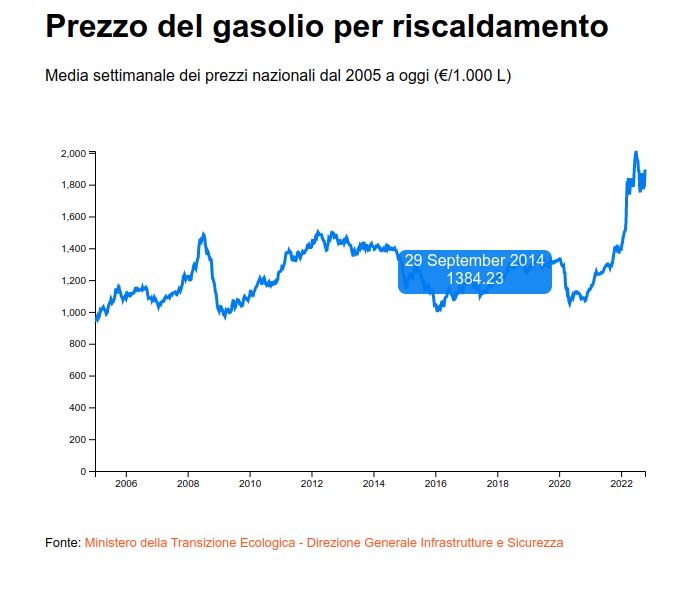

# Disegniamo il grafico

Non ci resta dunque che disegnare gli assi e il grafico sullo schermo selezionando con `.select()` il gruppo `<g>` e poi inserendo gli elementi con `.append()`.

Nel caso dell'asse y dovremo applicare una trasformazione per farlo comparire al piede del grafico invece che in alto:



```javascript
const chartBody = d3.select("#chart_body");
...
const createChart = (data) => {
   
  ...
  
  const valueLine = d3
    .line()
    .x((d) => xScale(d.date))
    .y((d) => yScale(d.price));
    
  chartBody.append("g")
    .call(d3.axisLeft(yScale));
  
  chartBody
    .append("g")
    .attr("transform", `translate(0, ${height})`)
    .call(d3.axisBottom(xScale));
}
```



Per disegnare l'andamento vero e proprio utilizzeremo un tag `<path>` a cui passeremo i dati.&#x20;

Nel caso degli andamenti per il binding dei dati si utilizza `.datum()`, invece di `.data()` perché i dati vengono associati a un unico elemento  `<path>` invece che ad una serie di elementi.&#x20;

Le istruzioni su come un `<path>` deve disegnare una linea sono contenute nell'attributo `d`, a cui noi passiamo la funzione `valueLine` che abbiamo impostato nel capitolo precedente.



```javascript
const chartBody = d3.select("#chart_body");

const createChart = (data) => {
   
  ...
  
  const line = d3
    .line()
    .x((d) => xScale(d.date))
    .y((d) => yScale(d.price));
    
  chartBody.append("g").call(d3.axisLeft(yScale));
  chartBody
    .append("g")
    .attr("transform", `translate(0, ${height})`)
    .call(d3.axisBottom(xScale));

  chartBody.append("path")
    .datum(data)
    .attr("d", valueLine)
    .attr("class", "line");  
  }
```



```css
.line {
  fill: none;
  stroke: #1c7af5;
  stroke-width: 3px;
}
```



I path SVG si chiudono automaticamente, dando vita a forme geometriche irregolari. Per mantere l'aspetto di una linea aperta, impostiamo le proprietà `fill` e `stroke` nello `style.css`


Per approfondire:\
\- [Understanding the difference between the d3 data and datum methods](https://www.intothevoid.io/data-visualization/understanding-d3-data-vs-datum/)\
\- [d attribute in SVG](https://developer.mozilla.org/en-US/docs/Web/SVG/Attribute/d)


A questo punto il grafico è fatto. Non resta che arricchirlo a piacere con ulteriori funzionalità come per esempio aggiungendo un tooltip al mouse over (vedi il codice condiviso nel link a piè di pagina)&#x20;

<figure><figcaption></figcaption></figure>


Il codice completo del grafico è disponibile a questo link: [https://github.com/CapMar00/d3js-line-chart](https://github.com/CapMar00/d3js-line-chart)


