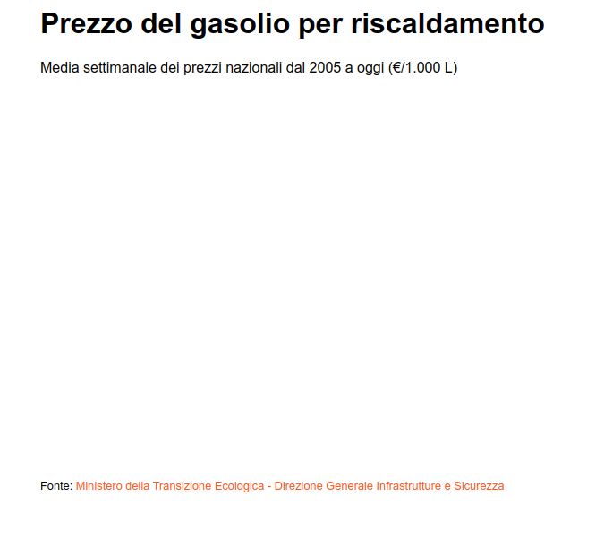

# Impostiamo la struttura

Per creare il grafico ci serviranno:

* &#x20;un file `index.html` che conterrà l'import della libreria `d3.js`
* qualche piccola impostazione di stile contenuta in `style.css`
* un file `chart.js` che conterrà il codice per generare il grafico

All'interno del tag `body` di `index.html` inseriamo già:

* titolo, sommario e fonte del grafico
* un tag `<svg>` `#chart` con all'interno un gruppo `<g>` `#chart_body` che conterrà il grafico, opportunamento traslato di qualche pixel per ottimizzare la visualizzazione.



```html
<!DOCTYPE html>
<html lang="it">

<head>
    <meta charset="UTF-8">
    <meta http-equiv="X-UA-Compatible" content="IE=edge">
    <meta name="viewport" content="width=device-width, initial-scale=1.0">
    <link rel="shortcut icon" href="#" type="image/x-icon">
    <link rel="stylesheet" href="css/style.css">
    <script src="https://cdnjs.cloudflare.com/ajax/libs/d3/7.6.1/d3.min.js"
        integrity="sha512-MefNfAGJ/pEy89xLOFs3V6pYPs6AmUhXJrRlydI/9wZuGrqxmrdQ80zKHUcyadAcpH67teDZcBeS6oMJLPtTqw=="
        crossorigin="anonymous" referrerpolicy="no-referrer"></script>
    <title>Prezzo del gasolio per il riscaldamento</title>
</head>

<body>
    <div id="container">
        <h1>Prezzo del gasolio per riscaldamento</h1>
        <p>Media settimanale dei prezzi nazionali dal 2005 a oggi (€/1.000 L)</p>
        <svg id="chart" width="700" height="400">
            <g id="chart_body" transform="translate(50,50)"></g>
        </svg>
        <div class=" source">
            Fonte: <a href="https://dgsaie.mise.gov.it/open-data" target="_blank" rel="noopener noreferrer">
                Ministero della Transizione Ecologica - Direzione Generale Infrastrutture e Sicurezza</a>
        </div>
    </div>
    <script src="chart.js"></script>
</body>
</html>
```



```css
body {
  font-family: Tahoma, sans-serif;
}

a:link {
  color: #fb5c01;
  text-decoration: none;
}

a:visited {
  color: #fb5c01;
  text-decoration: none;
}

a:hover {
  color: #fb5c01;
  text-decoration: underline;
}

a:active {
  color: #fb5c01;
  text-decoration: underline;
}

div.tooltip {
  position: absolute;
  text-align: center;
  width: 150px;
  height: 40px;
  padding: 2px;
  font: 16px;
  background: #1c7af5;
  color: #fff;
  border: 0px;
  border-radius: 8px;
  pointer-events: none;
}

#container {
  width: fit-content;
  margin: auto;
}

.source {
  padding-top: 30px;
  font-size: 0.8em;
}

```



```javascript
// codice d3
```



Ecco che cosa avremo in pagina:

<figure><figcaption></figcaption></figure>
