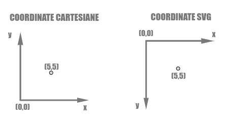

# Mappiamo i dati

A questo punto dobbiamo rapportare i dati che abbiamo allo spazio della visualizzazione definendo una larghezza `width` e un'altezza `height` e utilizzando le opportune scale:

* `d3.scaleTime()` per le date
* `d3.scaleLinear()` per i prezzi



```javascript
const createChart = (data) => {
  const width = 550;
  const height = 320;
  
  ...
  
  const dateRange = d3.extent(data, (d) => d.date);
  const maxValue = d3.max(data, (d) => d.price);

  const xScale = d3.scaleTime().range([0, width]).domain(dateRange);
  const yScale = d3.scaleLinear().range([height, 0]).domain([0, maxValue]);
}
```



Nel caso dell'asse y dobbiamo tenere conto che nel sistema di coordinate degli svg l'origine degli assi è in alto a sinistra e i valori aumentano procedendo verso il basso.

<figure><figcaption></figcaption></figure>


Per maggiori informazioni sul sistema di coordinate degli svg leggi qui: [https://www.sarasoueidan.com/blog/svg-coordinate-systems/](https://www.sarasoueidan.com/blog/svg-coordinate-systems/)

