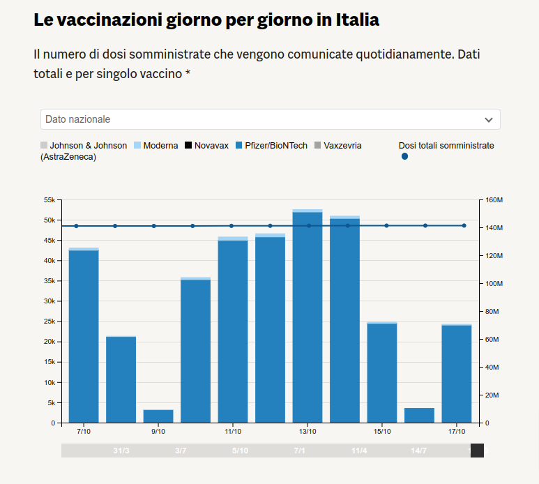

# 📖 Che cos'è D3.js

 è una libreria javascript open source per creare visualizzazioni e grafiche web.

La sua potenza è tutta racchiusa nelle tre D da cui prende il nome: Data-Driven Documents.

 permette infatti di creare contenuti interattivi e animati basandosi sui dati e di legandoli agli elementi esistenti nella pagina web.

É stata creata nel 2011 da [Mike Bostock](https://observablehq.com/@mbostock) , un informatico americano insieme ad alcuni membri dello Stanford Vis Group.&#x20;


Leggi il[ paper che sancisce la nascita di D3](http://vis.stanford.edu/files/2011-D3-InfoVis.pdf)


É ormai uno standard nel campo della visualizzazione dati ed è costantemente aggiornata e arrichita di nuove funzionalità. Attualmente l'ultima versione disponibile è la [v7](https://github.com/d3/d3/releases).

Con è possibile creare dai grafici più classici

<figure><figcaption>
<a href="https://lab24.ilsole24ore.com/numeri-vaccini-italia-mondo/">https://lab24.ilsole24ore.com/numeri-vaccini-italia-mondo/</a>
</figcaption></figure>

fino ai grafici più complessi&#x20;

<figure><figcaption>
<a href="https://lab24.ilsole24ore.com/qualita-della-vita/">https://lab24.ilsole24ore.com/qualita-della-vita/</a>
</figcaption></figure>

... e alle mappe

<figure><figcaption>
<a href="https://lab24.ilsole24ore.com/coronavirus/">https://lab24.ilsole24ore.com/coronavirus/</a>
</figcaption></figure>

Per creare queste visualizzazioni,  opera aggiungendo, rimuovendo e aggiornando gli elementi del DOM, in particolare degli SVG, a seconda dei dati a disposizione:

<figure><figcaption></figcaption></figure>
