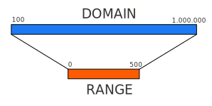

# Scale

I dati difficilmente corrispondono già alla posizione e alle dimensioni degli elementi grafici sullo schermo.

Per poterli normalizzare e visualizzare correttamente si utilizzano le scale che esprimono valori continui o discreti e rapporti lineari o più complessi. Eccone alcune:

* `d3.scaleLinear()`
* `d3.scaleLog()`
* `d3.scaleOrdinal()`
* `d3.scaleTime()`

Le scale lavorano su domain e range: `.domain()` fa riferimento al dominio dei dati mentre `.range()` allo spazio della visualizzazione.\


<figure><figcaption></figcaption></figure>

Le scale mappano il set di valori del domain nel set di valori del range secondo la relazione determinata dal tipo di scala prescelto:\


```javascript
let myScale = d3.scaleLinear()
  .domain([100, 1000000])
  .range([0, 500]);
```


Per approfondire:\
\- [D3 Scale Functions](https://www.d3indepth.com/scales/)\
\- [https://github.com/d3/d3-scale](https://github.com/d3/d3-scale)

